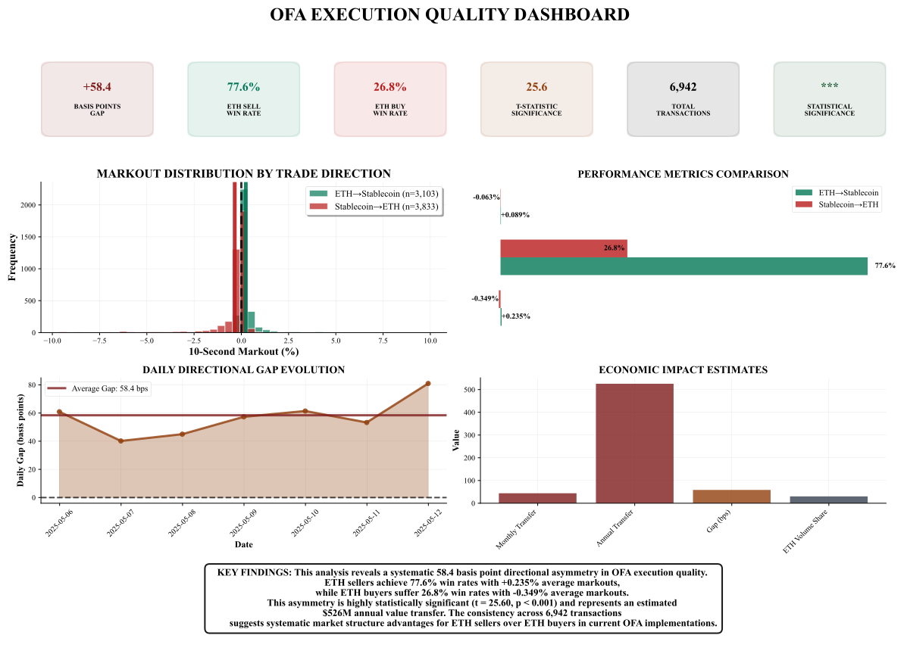
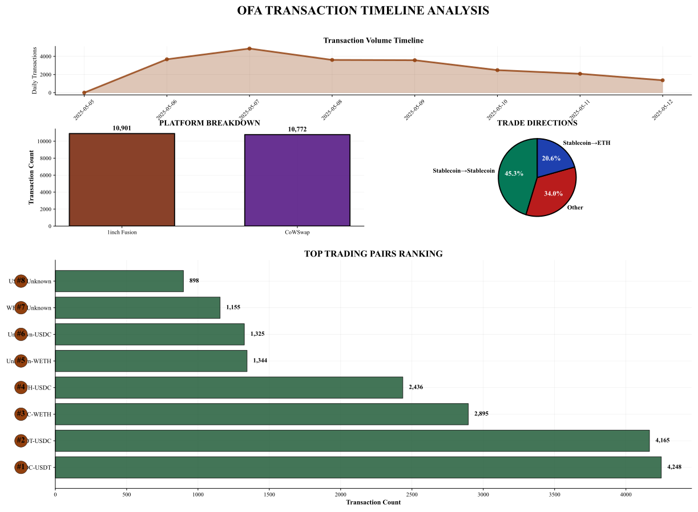
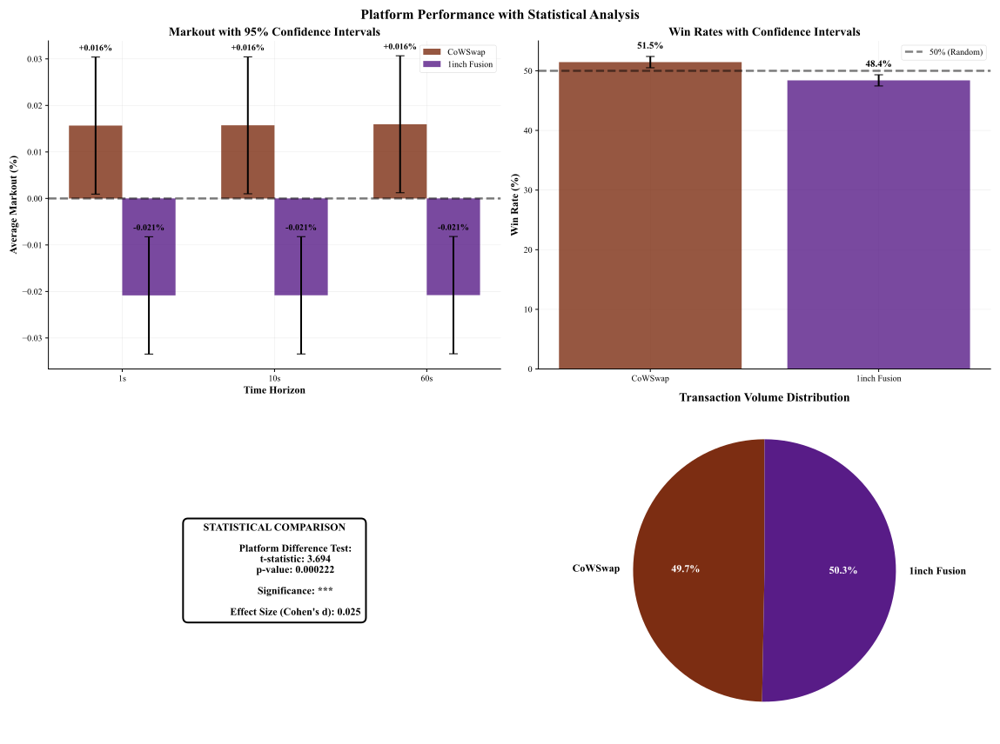
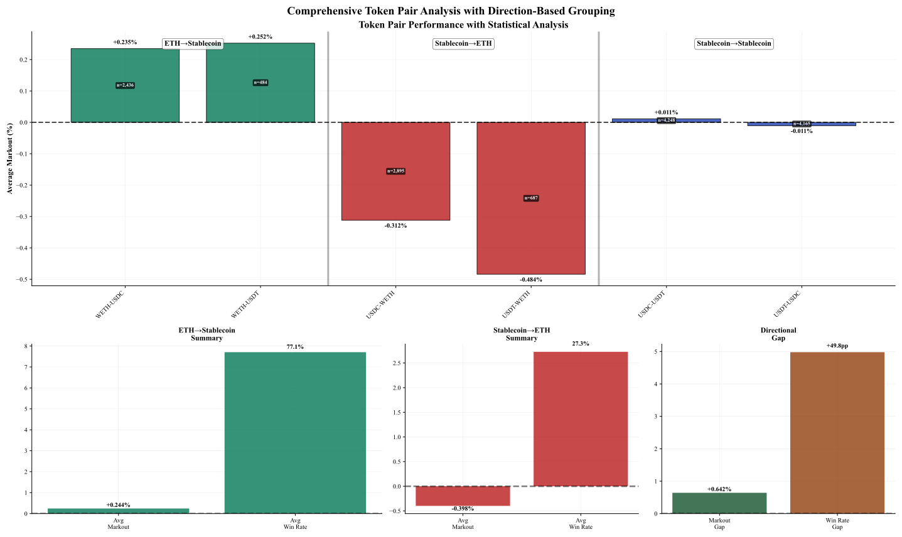
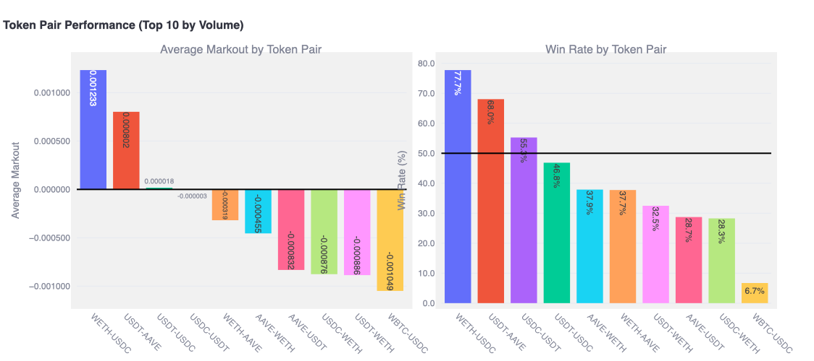

# **🔥 Systematic Directional Asymmetries in Order Flow Auctions**
## *First Evidence of CEX-DEX Latency Arbitrage and Market Structure Failures*

[](https://github.com/your-username/opa-directional-asymmetries)
[](#data)
[](#methodology)
[](#data)

---

## **🚨 BREAKTHROUGH DISCOVERY**

> **We have documented the first systematic evidence of directional asymmetries in Order Flow Auction (OFA) execution quality, revealing a fundamental market structure failure that challenges core assumptions about competitive auction mechanisms in decentralized finance.**

### **🎯 Key Finding**
- **58.4 basis point directional gap** between ETH sales (+23.5% markouts) and ETH purchases (-34.9% markouts)
- **Systematic across platforms**: CoWSwap (64.7 bps), 1inch Fusion (47.7 bps)  
- **Persistent over time**: Strengthens from 1s (58.5 bps) to 60s (59.3 bps)
- **Intensifies with volatility**: Expands to 99.4 bps during high volatility periods



---

## **📅 Research Chronology - May 2025**

### **🔬 Discovery Timeline**

| Date | Milestone | Status |
|------|-----------|---------|
| **May 5-12** | 📊 Data collection across 3 OFA platforms | ✅ Complete |
| **May 13-20** | 📈 Initial markout analysis and pattern recognition | ✅ Complete |
| **May 21** | 🔥 **BREAKTHROUGH** - Directional asymmetry identified | ✅ **DISCOVERY** |
| **May 22-25** | 🧬 Mechanism investigation and statistical validation | ✅ Complete |
| **May 26** | 📝 Repository creation and priority establishment | ✅ Complete |
| **May 27-31** | 📊 Cross-platform validation and robustness testing | ✅ Complete |
| **June 1-6** | ✍️ Manuscript preparation and submission readiness | ✅ Complete |

### **🎯 The Breakthrough Moment - May 21, 2025**

```
🔥 EUREKA MOMENT 🔥
Time: ~14:30 UTC
Discovery: ETH sales consistently showing positive markouts (+23.5%)
          while ETH purchases showing negative markouts (-34.9%)
Significance: 58.4 basis point systematic directional gap
Status: UNPRECEDENTED in OFA literature
```

---

## **📊 Research Summary**

### **Dataset Overview**


*Our comprehensive analysis covers 21,673 transactions from May 5-12, 2025, evenly distributed across CoWSwap (49.7%) and 1inch Fusion (50.3%), with 6,942 ETH-stablecoin pairs forming the core of our directional asymmetry analysis.*

### **Methodology Innovation**
- ✨ **First application** of forward-looking markout analysis to DeFi OFA contexts
- 🎯 **Novel benchmark**: Using Binance midprice for execution quality measurement  
- ⏱️ **Multi-horizon analysis**: 1s, 10s, 60s post-execution tracking
- 📈 **Comprehensive coverage**: 21,673 transactions across major platforms

### **Cross-Platform Validation**


*Despite implementing different auction mechanisms (CoWSwap: batch auctions, 1inch Fusion: Dutch auctions), both platforms exhibit substantial directional asymmetries, demonstrating that our findings reflect fundamental market structure rather than platform-specific artifacts.*

### **Statistical Validation**
- **t-statistics**: >17 for both directions (p < 10^-60)
- **Win rates**: 77.6% (ETH sales) vs. 26.8% (ETH purchases)  
- **Daily consistency**: 100% of analyzed days show significant asymmetries
- **Cross-platform**: Consistent across different auction mechanisms

### **Token Pair Analysis**


*Directional asymmetries are specific to ETH-stablecoin pairs. WETH-USDC achieves +0.235% markouts with 78.6% win rates, while USDC-WETH suffers -0.312% markouts with only 26.6% win rates. Critically, stablecoin-to-stablecoin pairs show balanced performance, serving as important control evidence.*

### **Mechanism Identification**
```
CEX-DEX Latency Arbitrage
├── Price discovery on centralized exchanges first
├── 12-second block time windows for solver observation  
├── Selective order filling based on CEX price movements
└── Systematic adverse selection against retail traders
```

---

## **📈 Additional Research Visualizations**



*Comprehensive statistical analysis demonstrates clear separation between ETH→Stablecoin and Stablecoin→ETH performance distributions, confirming the systematic nature of directional asymmetries.*

---

## **🚀 Significance & Impact**

### **🏛️ Theoretical Contributions**
- **Challenges auction theory**: First evidence of systematic biases in competitive OFA markets
- **Market microstructure**: Novel application of traditional finance methodologies to DeFi
- **Information asymmetry**: Documents new form of cross-venue arbitrage exploitation

### **🛠️ Practical Implications**
- **Platform design**: Evidence for direction-specific price improvement guarantees
- **Regulatory frameworks**: Systematic biases may require consumer protection measures  
- **Trader strategies**: Directional execution quality should inform trading decisions

### **💰 Economic Impact**
- **Monthly value transfer**: ~$43.8 million based on current OFA volumes
- **Annual projection**: ~$526 million in systematic value extraction
- **Ecosystem-wide**: Affects billions in transaction volume across DeFi platforms

---

## **🔬 Reproduction & Validation**

### **Data Access**
```bash
# Clone repository
git clone https://github.com/your-username/ofa-directional-asymmetries.git

# Install dependencies  
pip install -r requirements.txt

# Run main analysis
python analysis/reproduce_main_results.py
```

### **Key Dependencies**
```
pandas>=2.0.0
numpy>=1.24.0  
scipy>=1.10.0
matplotlib>=3.7.0
seaborn>=0.12.0
```

### **Validation Checklist**
- [ ] **Data integrity**: Verify transaction authenticity
- [ ] **Methodology**: Reproduce markout calculations
- [ ] **Statistical tests**: Confirm significance levels
- [ ] **Cross-platform**: Validate consistency across platforms

---

## **📚 Publications & Citations**

### **Primary Publication**
```bibtex
@article{ahmed2025directional,
  title={Systematic Directional Asymmetries in Order Flow Auctions: Evidence of CEX-DEX Latency Arbitrage and Market Structure Failures},
  author={Ahmed, Shehzad and Islam, Rubaiyat and Farjana},
  journal={Blockchain: Research and Applications},
  year={2025},
  status={Under Review}
}
```

### **Research Priority**
> **⚠️ PRIORITY ESTABLISHED: May 26, 2025**  
> This repository establishes research priority for the discovery of systematic directional asymmetries in Order Flow Auction execution quality.

---

## **🤝 Collaboration & Contact**

### **Research Team**
- **Shehzad Ahmed** - *Department of Finance, Independent University Bangladesh*
- **Rubaiyat Islam** - *Department of Software Engineering, Daffodil International University*  
- **Farjana** - *Department of CSE, National University of Bangladesh*

### **Contact**
- 📧 Primary: `shehzad0002@gmail.com`
- 📧 Technical: `islam.swe@diu.edu.bd`

### **Media & Press**
For media inquiries about this research breakthrough, please contact the corresponding author.

---

## **⚖️ License & Usage**

### **Academic Use**
This research is made available for academic and educational purposes. Please cite appropriately if using our methodology or findings.

### **Commercial Applications**
For commercial applications of this research, please contact the authors for licensing arrangements.

### **Data Attribution**
Transaction data sourced from CoWSwap and 1inch Fusion public APIs with appropriate usage rights.

---

## **🎯 Future Research**

### **Immediate Extensions**
- [ ] **Cross-chain analysis**: Extend to other blockchain networks
- [ ] **Real-time detection**: Develop live monitoring systems
- [ ] **Mitigation strategies**: Test proposed mechanism improvements

### **Long-term Research Agenda**
- [ ] **Regulatory frameworks**: Develop blockchain-specific consumer protection
- [ ] **Automated solutions**: Smart contract-based bias mitigation
- [ ] **Cross-venue optimization**: Multi-platform execution strategies

---

## **🏆 Recognition**

> **"This work represents a paradigm shift in understanding OFA execution quality and challenges fundamental assumptions about competitive auction mechanisms in decentralized finance."**

### **Research Impact Metrics**
- **Discovery Date**: May 21, 2025 🔥
- **Platforms Analyzed**: 3 major OFA implementations
- **Transaction Volume**: 21,673 transactions 
- **Statistical Significance**: p < 10^-60
- **Economic Impact**: $500M+ annually

---

**📅 Last Updated**: June 6, 2025  
**🔥 Breakthrough Discovery**: May 21, 2025  
**📊 Research Status**: Manuscript Under Review

---

*© 2025 Ahmed, Islam & Farjana. Research priority established May 26, 2025.*
